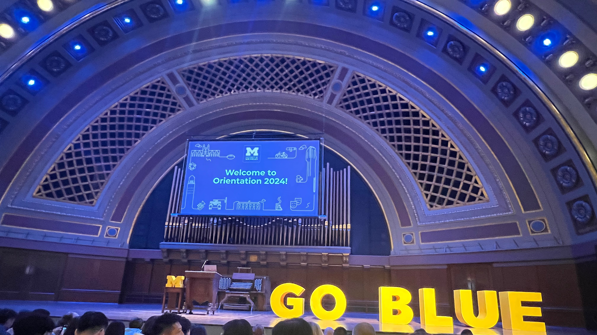
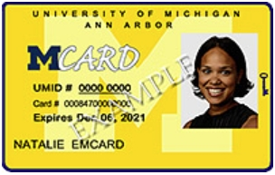
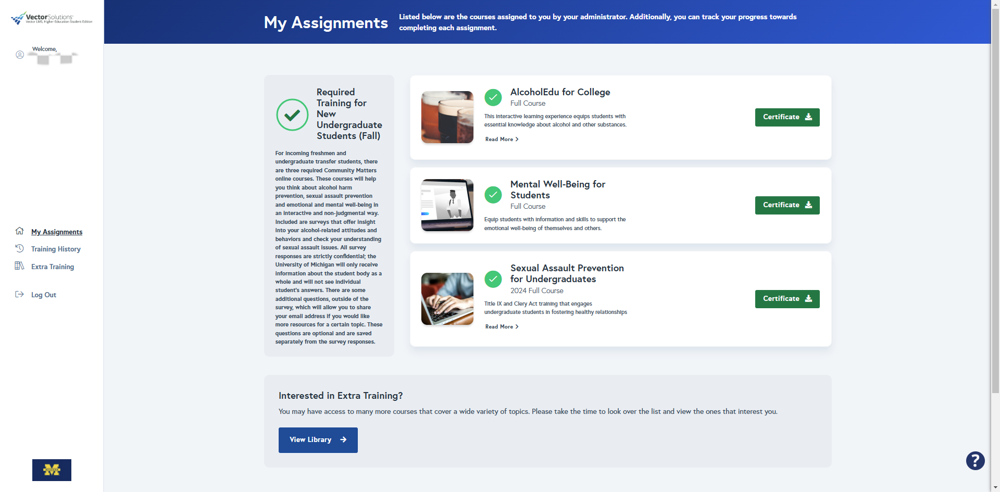
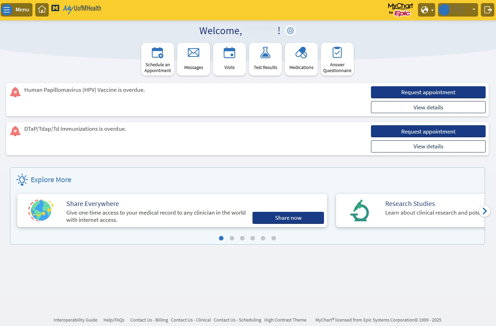
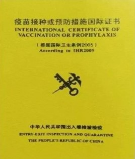

# Enrollment Preparation

## UM Account Setup

[https://accounts.it.umich.edu/uniqname/verify/](https://accounts.it.umich.edu/uniqname/verify/)

Soon after the student accepts the offer, Michigan IT Service will send an email to help the student set up his/her own university account.

<figure><figcaption></figcaption></figure>

Just like JAccount, you'll need your UM account to get access to all kinds of service on campus, which will be introduced in detail in the following parts.

## Major Confirmation

About a week after the student accepts the offer, UM Engineering Advising Center will send an email to confirm the major he/she selected when submitting the application. The student will be able to transfer his/her major in UM by **replying with an email that states the reason why he/she wants to transfer to that major**. If accepted, the student will get transferred to the new major before fall course registration.


According to the latest major transfer policy, students are not allowed to transfer to **Computer Science** or **Robotics** through this process.


## Academic Advising & On-campus Orientation

In mid-April, every new UM student receives an email from U-M New Student Programs reminding them to make an appointment for academic advising and on-campus orientation.

### Academic Advising: Get Ready for Fall!

Academic advising informs the student of his/her major program's degree requirement and confirms the student's current process on it. For JI students, academic advising is organized **in-person** for a unified time in June annually. However, students **are required to register for a spot online** following the steps listed in the email.

The most important part of the academic advising is the course registration advising. Students will be given the dates when course registration for the fall semester is open, during which advising sessions are organized by JI IPO and student advisors from all DD majors in U-M. Students **are required to** register for courses in the coming fall semester under the guidance of U-M advisors in-person before the registration deadline. The course registration guideline is introduced in detail in the part "Course Registration" below.

### On-campus Orientation: Get Familiar with the Campus!

[Orientation appointment](https://mx.technolutions.net/ss/c/u001.yAWHLkb7QxrqAOlNdz1qpadMcvMc0nQkqK72E_pr81Mh00P39IteEf5WJsjT0bBWYSMjATPvfLy2R6NFYpuP1MRcadVoluHGraK-MQPbG1NbyZi0z3WgzhWNPilUvdFXu-9i9oG5PviE2oUV8xrYeZga_qQSCkLev_QzTB5AkcbNInAgloHErbeX9qSRuU-v/45d/2ZbZnaKdRNePQTrUrpvQLQ/h2/h001.gzdVaTNWlz0Obdh8VIqJpBuvr9aRtDjAfn8eyRtA01U)

On-campus Orientation should be registered along with Academic Advising. It usually takes place a few days before the fall semester begins, and based on student's personal schedule, he/she could choose a preferred time slot for this unique experience.


For reference, in 2024, the orientation took place on August 21st and 24th.


On the orientation day, new students receive their M-cards at the location specified in the appointment confirmation email, followed by a welcoming speech in the Hill Auditorium. The 3rd part will be student leaders showing new students around the campus, and some fun social activities. Needless to say, it's a great chance for new students to make friends with peers.

<figure><figcaption></figcaption></figure>


Students are required to receive their M-cards in-person on the orientation day. However, it is allowed to skip all the following activities in case of uncontrollable circumstances. No matter if the student participates in any activity on the orientation day, he/she is required to pay the orientation fee (for reference, $300 in 2024), which is paid together with tuition of the fall semester.


## Pre-advising Course Online

After scheduling Academic Advising, every new student **must** take the [pre-advising course](https://mx.technolutions.net/ss/c/u001.XEfBm45kvnMxKIc7tKAAI4oLfNWSWNLkdH5B0CM8cyPk4AkcmsOStX7doYPKzUKyUuIqOVSoubn0c6UKw91CNBRC1IfjcsGD4I0Wxltvj3bFsaXnTe578lJlvzWYyXJ8PiEBtzG9Lb-OvFAqbxt85XSTyMONEbwyqbpmWEc9eQA/45d/2ZbZnaKdRNePQTrUrpvQLQ/h4/h001.fsb9Ct4U4PtM-jqtyXiVDPAE1fQmbpL0Mp0xDsm9ftI) required by U-M New Student Programs. It takes about 4 hours to finish this course series, and this should be done at least a week before the in-person Academic Advising.


Some videos in the course series could only be streamed with VPN on. It is recommended to take the course with VPN activated during the entire process.


## M-card

M-card serves as identification for students, faculty and staffs in UM. Every new student gets their own M-card on the orientation day for free.

<figure><figcaption></figcaption></figure>

The situations where students need their M-cards include but are not limited to:

* For many exams, students need to bring their M-card to prove their identities.
* For students enrolled in any meal plan, they need to swipe M-cards to get access into cafeterias.
* To consume with Blue Bucks, students need to swipe M-cards at cashiers.
* To get access to public printers on campus, students need to sign in by swiping M-cards on printers.
* To enter campus buildings on weekends or holidays, students need to swipe M-cards at building entrances.
* With an M-card, students could take the Ride (Ann Arbor city bus) for free.

### M-card Photo Submission

[https://finance.umich.edu/treasury/mcard/timesaver](https://finance.umich.edu/treasury/mcard/timesaver)

Students **are required to submit** a personal photo online that will be used in their M-cards. Once the photo is approved, the student will receive a confirmation email.

## UM Community Matters Course

[https://umichstudents-mi.vectorlmsedu.com/](https://umichstudents-mi.vectorlmsedu.com/)

In early August, all new students will receive an email from U-M Community Matters about a course series. These courses include video tutorials and quizzes that teach students about important health and moral values like alcohol education and mental wellness introduction. Students **are required to finish all courses required on the dashboard by the beginning of the fall semester**.

<figure><figcaption></figcaption></figure>

## UMHealth

### Account Sign-up

[MyUofMHealth](https://www.myuofmhealth.org/MyChart-PRD/Authentication/Login) is the student portal for personal health affairs.

<figure><figcaption></figcaption></figure>

In April, new students will receive an email from Michigan Medicine. The email provides **a unique link** for each student to sign up a personal MyUofMHealth account. It's highly recommended that students **sign up their accounts as soon as they receive the email** since the sign-up link could expire, and students could receive their insurance card as soon as possible.

### Vaccination Proof Upload

As long as the student creates his/her MyUofMHealth account, he/she can upload the vaccination proof onto the portal. Then medical suggestions on recommended vaccines will be given on the portal.

The recommended form of vaccination proof is the **International Certificate of Vaccination or Prophylaxis**. It can be accessed by visiting the International Health Care Travel Center with the domestic vaccination record.

<figure><figcaption></figcaption></figure>

## Other Information

### Placement Exam

There's no need for JI students to take any placement exam at all. Just ignore related notices and content.

## References

* UM Account Setup: [https://accounts.it.umich.edu/uniqname/verify/](https://accounts.it.umich.edu/uniqname/verify/)
* UM Account Documentation: [https://documentation.its.umich.edu/node/672](https://documentation.its.umich.edu/node/672)
* On-campus Orientation Appointment: [https://mx.technolutions.net/ss/c/u001.yAWHLkb7QxrqAOlNdz1qpadMcvMc0nQkqK72E\_pr81Mh00P39IteEf5WJsjT0bBWYSMjATPvfLy2R6NFYpuP1MRcadVoluHGraK-MQPbG1NbyZi0z3WgzhWNPilUvdFXu-9i9oG5PviE2oUV8xrYeZga\_qQSCkLev\_QzTB5AkcbNInAgloHErbeX9qSRuU-v/45d/2ZbZnaKdRNePQTrUrpvQLQ/h2/h001.gzdVaTNWlz0Obdh8VIqJpBuvr9aRtDjAfn8eyRtA01U](https://mx.technolutions.net/ss/c/u001.yAWHLkb7QxrqAOlNdz1qpadMcvMc0nQkqK72E_pr81Mh00P39IteEf5WJsjT0bBWYSMjATPvfLy2R6NFYpuP1MRcadVoluHGraK-MQPbG1NbyZi0z3WgzhWNPilUvdFXu-9i9oG5PviE2oUV8xrYeZga_qQSCkLev_QzTB5AkcbNInAgloHErbeX9qSRuU-v/45d/2ZbZnaKdRNePQTrUrpvQLQ/h2/h001.gzdVaTNWlz0Obdh8VIqJpBuvr9aRtDjAfn8eyRtA01U)
* Pre-advising course online: [https://mx.technolutions.net/ss/c/u001.XEfBm45kvnMxKIc7tKAAI4oLfNWSWNLkdH5B0CM8cyPk4AkcmsOStX7doYPKzUKyUuIqOVSoubn0c6UKw91CNBRC1IfjcsGD4I0Wxltvj3bFsaXnTe578lJlvzWYyXJ8PiEBtzG9Lb-OvFAqbxt85XSTyMONEbwyqbpmWEc9eQA/45d/2ZbZnaKdRNePQTrUrpvQLQ/h4/h001.fsb9Ct4U4PtM-jqtyXiVDPAE1fQmbpL0Mp0xDsm9ftI](https://mx.technolutions.net/ss/c/u001.XEfBm45kvnMxKIc7tKAAI4oLfNWSWNLkdH5B0CM8cyPk4AkcmsOStX7doYPKzUKyUuIqOVSoubn0c6UKw91CNBRC1IfjcsGD4I0Wxltvj3bFsaXnTe578lJlvzWYyXJ8PiEBtzG9Lb-OvFAqbxt85XSTyMONEbwyqbpmWEc9eQA/45d/2ZbZnaKdRNePQTrUrpvQLQ/h4/h001.fsb9Ct4U4PtM-jqtyXiVDPAE1fQmbpL0Mp0xDsm9ftI)
* M-card photo submission: [https://finance.umich.edu/treasury/mcard/timesaver](https://finance.umich.edu/treasury/mcard/timesaver)
* U-M Community Matters course: [https://umichstudents-mi.vectorlmsedu.com/](https://umichstudents-mi.vectorlmsedu.com/)
* MyUofMHealth: [https://www.myuofmhealth.org/MyChart-PRD/Authentication/Login](https://www.myuofmhealth.org/MyChart-PRD/Authentication/Login)
