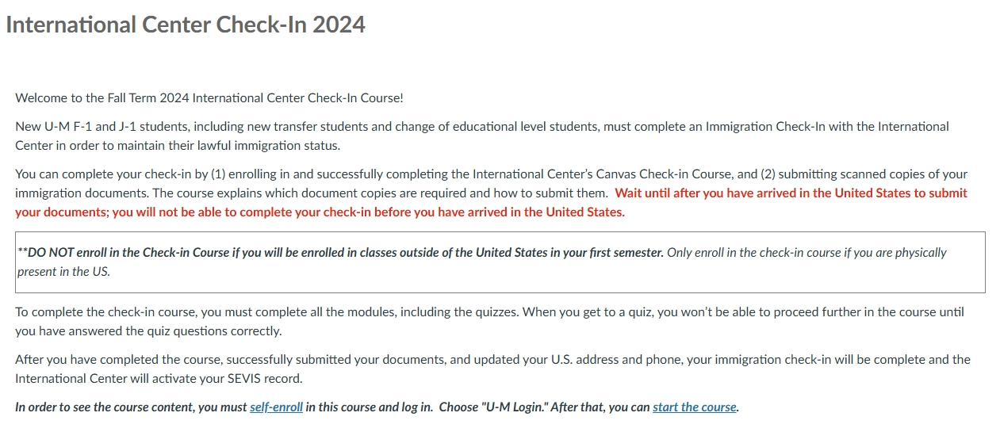
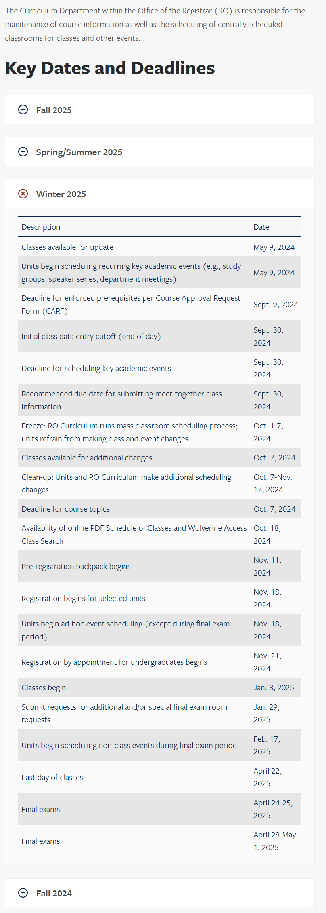

# Check-in Things TODO

## SEVIS Check-in


This part should be done after the student arrives to the US.


To activate SEVIS status, every international student **is responsible for** a series of confirmation steps once he/she arrives to the US.

Students should first self-enroll in the course "**International Center Check-in**" through the link attached in the email from U-M International Center.

<figure><figcaption>
Canvas Course: International Center Checkin
</figcaption></figure>

Relevant documents and some quizzes need to be done on the course page. It's also required to upload several necessary identification files onto M-Passport following guidance on the course page. Finally, students are asked to update their US addresses and other necessary contact information on WolverineAccess.

Detailed steps and tasks will be introduced in the email from U-M International Centers.

## Tuition Payment

UM is open to multiple payment services, below are some popular ways for tuition payment.

### Debit Card Payment

For this payment method, **a debit card issued by a bank in the US is necessary**.

Follow the links in [WolverineAccess](https://wolverineaccess.umich.edu/): **Student Business -> Campus Finances -> Account Inquiry**. The current balance would be shown in the tab. Click "Pay Now" to add necessary card information and pay tuition.

### Flywire Transfer

Flywire allows CNY payment for tuition. However, its currency rate from CNY to USD is lower compared with international standard rate, and the extra service charges about 1000 RMB. For those who prefer tuition not to be included as USD exchange limit, Flywire is a feasible way of payment.

<figure><figcaption></figcaption></figure>

## Course Registration

### Timeline

Different with course registration timeline in JI, U-M students start course registration for the next semester during the current semester. General time periods for course registration are listed on the [Office of Registrar website](https://ro.umich.edu/faculty-staff/curriculum).

<figure><figcaption></figcaption></figure>

**Different students may be assigned different time periods for course registration specifically.** These could be checked on the course registration website once noticed by email.

### Backpack

Course registration can be completed through [WolverineAccess](https://wolverineaccess.umich.edu/): **Backpack/Register for Class**. The Backpack function on the course registration website helps students plan ahead for official registration and makes it easier to register for courses within a couple of clicks.

<figure><figcaption></figcaption></figure>

Usually, the Backpack opens a couple days before official registration, between which the period is called pre-registration. During this period, students could check all courses and their related information on the website and add those of interest in the Backpack. Once the official registration opens, students who have pre-registered with the Backpack only need to select those courses that they would like to take next semester and proceed to the registration step. As long as there's still spots available, the registration process would be done!

### Waitlist

When adding courses to the Backpack, students could select the Waitlist option for potential needs. If the option is selected and the course spots are full when the student is officially registering for the course, he/she would be added to the Waitlist of this course section. Once anyone else drops a spot in the section, .

<figure><figcaption></figcaption></figure>

## Medical Insurance

Medical insurance **is required for all international undergraduate students**. Students are recommended to take the insurance plan provided by the Blue Cross Blue Shield of Michigan (BCBSM) [https://www.bcbsm.com/umich/index/](https://www.bcbsm.com/umich/index/). However, students are also free to choose another external insurance plan as long as it's recognized by U-M Health. Relevant information could be accessed [here](https://www.uofmhealth.org/patient-visitor-guide/insurance).

<figure><figcaption></figcaption></figure>

The insurance plan provides students access to various medical services (e. g. vaccines), and helps save huge medical cost if any medical incident happens.

For those participating in the BCBSM plan, student insurance account activation could be done under the guidance of emails sent from the BCBSM in August. the BCBSM will then send an **insurance card** to the mail address, which is the proof of enrollment in the plan during any medical service in the future. Starting from the beginning of study in U-M, a monthly insurance fee is due on the student account **per month**. Enroll in automatic payment plan or remember to pay monthly on the website to avoid late fee.
