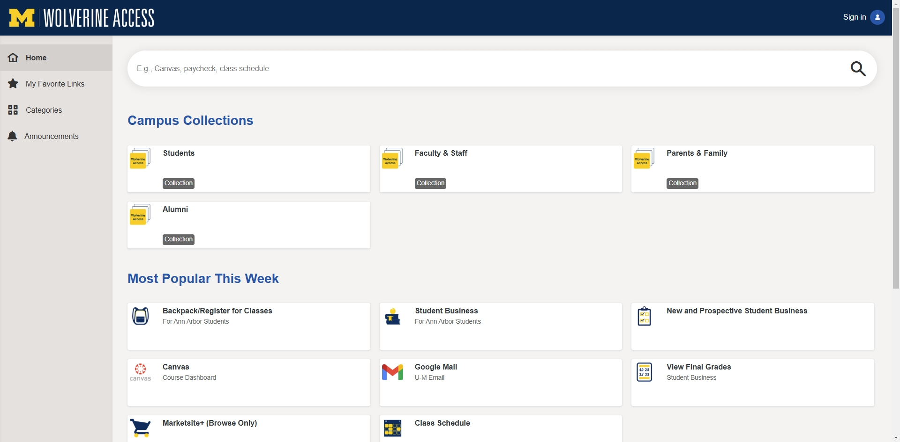
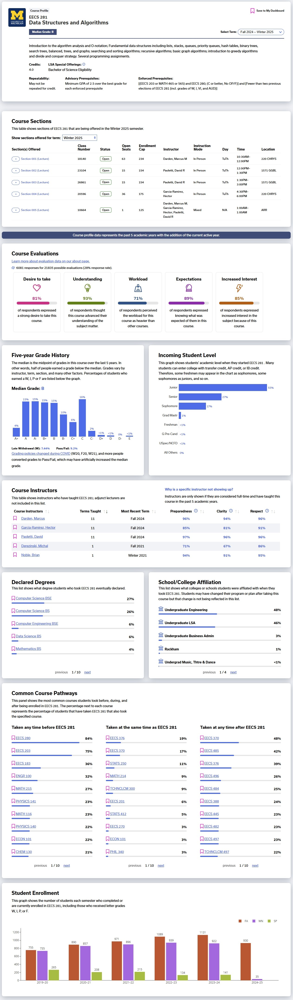
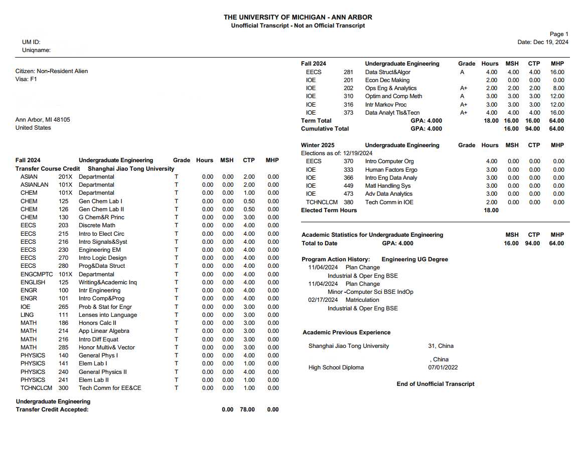

# Check-in

## SEVIS Check-in


This part should be done after the student arrives to the US.


To activate SEVIS status, every international student **is responsible for** a series of confirmation steps once he/she arrives to the US.

Students should first self-enroll in the course "**International Center Check-in**" through the link attached in the email from U-M International Center.

<figure><figcaption></figcaption></figure>

Relevant documents and some quizzes need to be done on the course page. It's also required to upload several necessary identification files onto M-Passport following guidance on the course page. Finally, students are asked to update their US addresses and other necessary contact information on WolverineAccess.

Detailed steps and tasks will be introduced in the email from U-M International Centers.

## WolverineAccess

WolverineAccess is a function-navigation webpage for UM students, faculty and other university-related personnel. All kinds of services of the university could be located and accessed conveniently through the webpage. Below are some common and useful functions for new students.

<figure><figcaption></figcaption></figure>

### Tuition Payment

UM is open to multiple payment services, below are some popular ways for tuition payment.

#### Debit Card Payment

For this payment method, **a debit card issued by a bank in the US is necessary**.

Follow the links in WolverineAccess: **Student Business -> Campus Finances -> Account Inquiry**. The current balance would be shown in the tab. Click "Pay Now" to add necessary card information and pay tuition.

#### Flywire Transfer

Flywire allows CNY payment for tuition. However, its currency rate from CNY to USD is lower compared with international standard rate, and the extra service charges about 1000 RMB. For those who prefer tuition not to be included as USD exchange limit, Flywire is a feasible way of payment.

<figure><figcaption></figcaption></figure>

### Course Registration

#### Timeline

Different with course registration timeline in JI, U-M students start course registration for the next semester during the current semester. General time periods for course registration are listed on the [Office of Registrar website](https://ro.umich.edu/faculty-staff/curriculum).

<figure><figcaption></figcaption></figure>

**Different students may be assigned different time periods for course registration specifically.** These could be checked on the course registration website once noticed by email.

#### Backpack

The Backpack function on the course registration website helps students plan ahead for official registration and makes it easier to register for courses within a couple of clicks.

<figure><figcaption></figcaption></figure>

Usually, the Backpack opens a couple days before official registration, between which the period is called pre-registration. During this period, students could check all courses and their related information on the website and add those of interest in the Backpack. Once the official registration opens, students who have pre-registered with the Backpack only need to select those courses that they would like to take next semester and proceed to the registration step. As long as there's still spots available, the registration process would be done!

#### Waitlist

When adding courses to the Backpack, students could select the Waitlist option for potential needs. If the option is selected and the course spots are full when the student is officially registering for the course, he/she would be added to the Waitlist of this course section and will be **automatically enrolled in** the section the moment anyone else drops a spot in the section.

<figure><figcaption></figcaption></figure>

### Credit Transfer

#### Websites

For credits from U-M to JI, please refer to the [JI credit transfer database](https://app.ji.sjtu.edu.cn/equivalence).

For credits from JI to U-M, please refer to the [U-M credit transfer database](https://tcaf.engin.umich.edu/equivalencies/).

If you the course credit you want to transfer from U-M to JI isn't listed in the JI credit transfer database, you could initiate an application on [JI BPM](https://bpm.umji.sjtu.edu.cn/jibpm).


Check your credit progress in both institutes every semester and plan ahead to make sure that you could graduate in the very semester as you wish. Take courses whose credit could be counted in both institutes would be a good idea to reduce credit pressure.


#### Suggestions

* **\[JI]ECE4010J** could be transferred to U-M as different credits according to students' specific requirement. Some examples are listed below.
  * Data Science: **\[U-M]STATS412** or **\[U-M]STATS250**
  * Other EECS: **\[U-M]EECS301**
  * Industrial & Operations Engineering: **\[U-M]IOE265**
* Industrial & Operations Engineering: Gaining credits in **\[JI]MATH1860J** + **\[JI]MATH2850J** + **\[JI]MATH2860J** could be regarded as gaining credits of **\[U-M]MATH214**.

### UM Canvas

Similar to JI, UM also uses Canvas as the main teaching platform, but in UM, course page DIYs by various course providers are popular and lots of useful external links and functions are available through the platform like Lecture Recordings, Teaching Evaluations, Gradescope, etc.

<figure><figcaption></figcaption></figure>

### Atlas

Atlas is a platform for U-M students to access course resources and relevant information. It's equipped with various built-in functions, which make countless students much more convenient to locate courses of interest, evaluate credit progress and build potential schedules. Grades and feedbacks from previous years are clearly shown so that students would be prepared if they're planning to take the course. Besides, the course page provides academic statistics of students who have taken the course in the past that helps viewers determine whether they fit the course.

<figure><figcaption></figcaption></figure>

### Transcripts & Audits

Students get access to their unofficial transcripts 24/7 on WolverineAccess in the tab "**View Unofficial Transcript**". The document provides students a clear view of their current academic performance and serves as reference for various potential academic, research and career opportunities.

<figure><figcaption></figcaption></figure>

Besides, degree check audits are also available for students to check their current credit progress and status towards graduation. Students could access their own audits through [**Backpack/Register for Classes**](https://wolverineaccess.umich.edu/launch-task/all/backpacking?collection=_popular_) **->** [**My Academics**](https://csprod.dsc.umich.edu/psc/csprodnonop/EMPLOYEE/SA/c/SA_LEARNER_SERVICES.SSS_MY_ACAD.GBL?Page=SSS_MY_ACAD\&Action=U) **-> Detail Report PDF**.

<figure><figcaption></figcaption></figure>

### MPrint

UM provides convenient print service for students at plenty of locations on campus. on the MPrint website, it takes only a few seconds for students to upload files in local directories or Google Drive to the task queue, and then head to any available printer on campus, sign in, and release the tasks.

<figure><figcaption></figcaption></figure>

UM gives out **$24** printing allowance per student/term, and the cost table is shown on the [ITS website](https://its.umich.edu/computing/computers-software/campus-computing-sites/printing/printing-charges).

<figure><figcaption></figcaption></figure>

### UM-GPT

UM ITS provides various GPT API services for students. Current services include GPT-4o, Llama 3 (70b) and DALL·E 3. It's often more reliable if visited from China since it does not require VPN to access.

## Other Information

### Insurance

Medical insurance **is required for all international undergraduate students**. Students are recommended to take the insurance plan provided by the Blue Cross Blue Shield of Michigan (BCBSM). However, students are also free to choose another external insurance plan as long as it's recognized by U-M Health. Relevant information could be accessed [here](https://www.uofmhealth.org/patient-visitor-guide/insurance).

<figure><figcaption></figcaption></figure>

The insurance plan provides students access to various medical services (e. g. vaccines), and helps save huge medical cost if any medical incident happens.

For those participating in the BCBSM plan, student insurance account activation could be done under the guidance of emails sent from the BCBSM in August. the BCBSM will then send an **insurance card** to the mail address, which is the proof of enrollment in the plan during any medical service in the future. Starting from the beginning of study in U-M, a monthly insurance fee is due on the student account **per month**. Enroll in automatic payment plan or remember to pay monthly on the website to avoid late fee.

## References

* UM-GPT: [https://umgpt.umich.edu/](https://umgpt.umich.edu/)
* BCBSM U-M plan: [https://www.bcbsm.com/umich/index/](https://www.bcbsm.com/umich/index/)
* JI credit transfer database: [https://app.ji.sjtu.edu.cn/equivalence](https://app.ji.sjtu.edu.cn/equivalence)
* U-M credit transfer database: [https://tcaf.engin.umich.edu/equivalencies/](https://tcaf.engin.umich.edu/equivalencies/)
* U-M Course Registration Timeline: [https://ro.umich.edu/faculty-staff/curriculum](https://ro.umich.edu/faculty-staff/curriculum)
