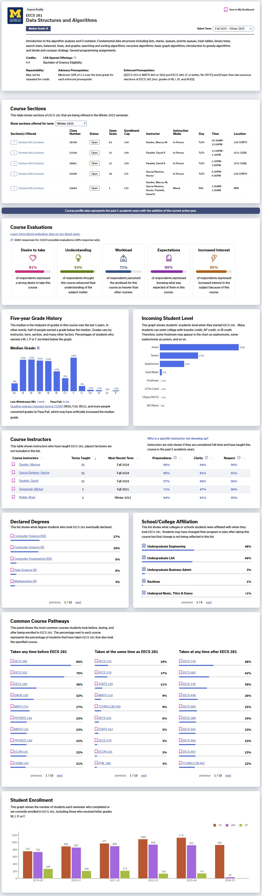

# UM Toolkits

## WolverineAccess

[https://wolverineaccess.umich.edu/](https://wolverineaccess.umich.edu/)

WolverineAccess is a function-navigation webpage for UM students, faculty and other university-related personnel. All kinds of services of the university could be located and accessed conveniently through the webpage. Below are some common and useful functions for new students.

<figure><figcaption></figcaption></figure>

## UM Canvas

Similar to JI, UM also uses Canvas as the main teaching platform, but in UM, course page DIYs by various course providers are popular and lots of useful external links and functions are available through the platform like Lecture Recordings, Teaching Evaluations, Gradescope, etc.

<figure><figcaption></figcaption></figure>

## Atlas

Atlas is a platform for U-M students to access course resources and relevant information. It's equipped with various built-in functions, which make countless students much more convenient to locate courses of interest, evaluate credit progress and build potential schedules. Grades and feedbacks from previous years are clearly shown so that students would be prepared if they're planning to take the course. Besides, the course page provides academic statistics of students who have taken the course in the past that helps viewers determine whether they fit the course.

<figure><figcaption></figcaption></figure>

## Transcripts & Audits

Students get access to their unofficial transcripts 24/7 on WolverineAccess in the tab "**View Unofficial Transcript**". The document provides students a clear view of their current academic performance and serves as reference for various potential academic, research and career opportunities.

<figure><figcaption></figcaption></figure>

Besides, degree check audits are also available for students to check their current credit progress and status towards graduation. Students could access their own audits through [**Backpack/Register for Classes**](https://wolverineaccess.umich.edu/launch-task/all/backpacking?collection=_popular_) **->** [**My Academics**](https://csprod.dsc.umich.edu/psc/csprodnonop/EMPLOYEE/SA/c/SA_LEARNER_SERVICES.SSS_MY_ACAD.GBL?Page=SSS_MY_ACAD\&Action=U) **-> Detail Report PDF**.

<figure><figcaption></figcaption></figure>

## MPrint

UM provides convenient print service for students at plenty of locations on campus. on the MPrint website, it takes only a few seconds for students to upload files in local directories or Google Drive to the task queue, and then head to any available printer on campus, sign in, and release the tasks.

<figure><figcaption></figcaption></figure>

UM gives out **$24** printing allowance per student/term, and the cost table is shown on the [ITS website](https://its.umich.edu/computing/computers-software/campus-computing-sites/printing/printing-charges).

<figure><figcaption></figcaption></figure>

## UM-GPT

[https://umgpt.umich.edu/](https://umgpt.umich.edu/)

UM ITS provides various GPT API services for students. Current services include GPT-4o, Llama 3 (70b) and DALL·E 3. It's often more reliable if visited from China since it does not require VPN to access.
